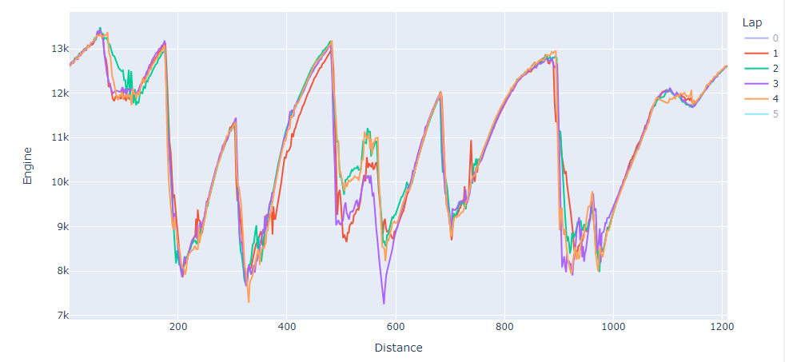
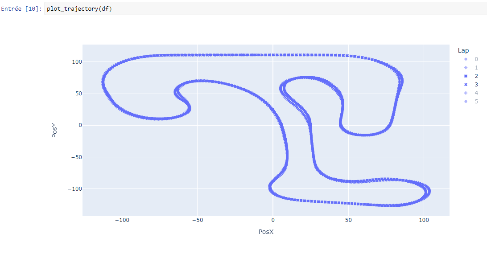
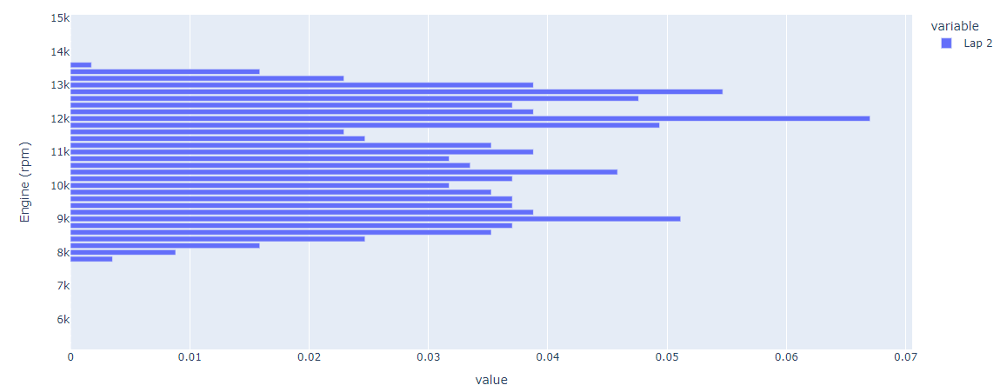
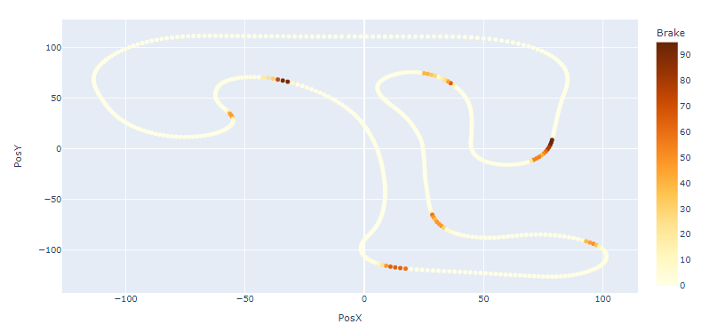
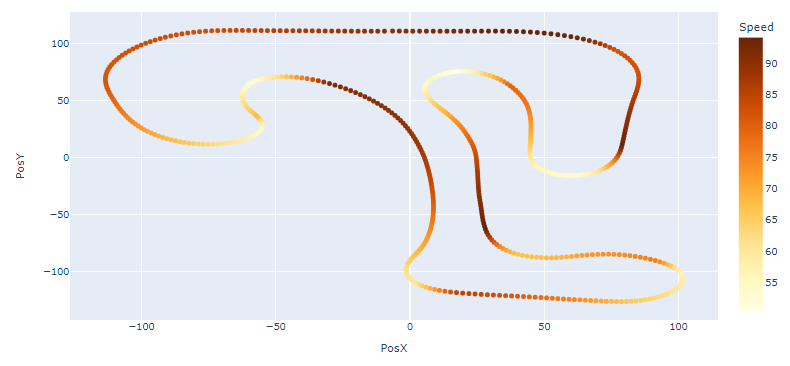
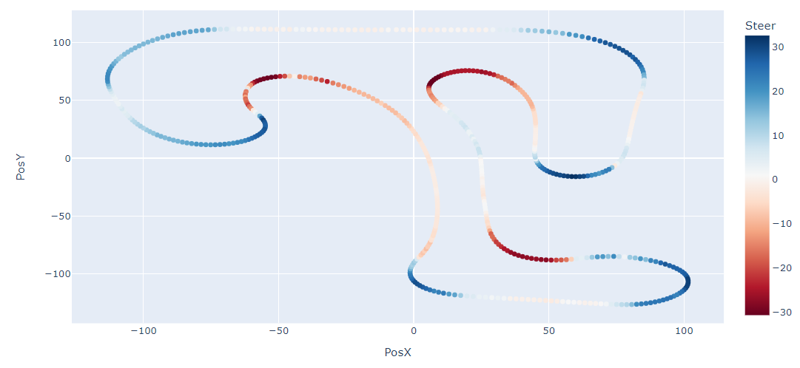
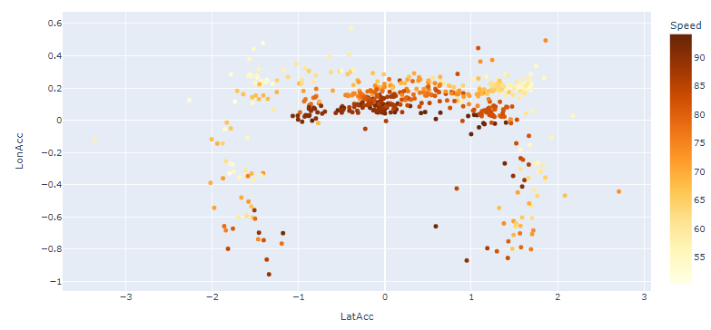

# krp_python_telemetry

Telemetry for [Kart Racing Pro](https://www.kartracing-pro.com/) using Python notebook ([Jupyter](https://jupyter.org/)) or using [Google Colab](https://colab.research.google.com/github/scls19fr/krp_python_telemetry/blob/main/telemetry.ipynb)

## Screenshots

Plot various data such as Engine (rpm), Distance,	CylHeadTemp	(°C), WaterTemp (°C), Gear, Speed	(km/h), LatAcc (G), LonAcc (G), Steer (°), Throttle (%), Brake (%), FrontBrakes (%), Clutch (%), YawVel (deg/s)

- Engine (rpm) vs Laptime

```python
$ plot_lap_data(df, "Engine")
```


- Engine (rpm) vs Distance

```python
$ plot_lap_data(df, "Engine", index="Distance")
```



Compare trajectory among differents laps

```python
$ plot_trajectory(df)
```



Plot Engine (rpm) histogram



Display Brake use on trajectory

```python
$ px.scatter(df[df["Lap"] == 4], x="PosX", y="PosY", color="Brake", hover_name="Laptime", color_continuous_scale="YlOrBr")
```



Display Speed on trajectory

```python
$ px.scatter(df[df["Lap"] == 4], x="PosX", y="PosY", color="Speed", hover_name="Laptime", color_continuous_scale="YlOrBr")
```



Display Steer angle on trajectory

```python
$ px.scatter(df[df["Lap"] == 4], x="PosX", y="PosY", color="Steer", hover_name="Distance", color_continuous_scale="RdBu")
```



Display friction circle

```python
px.scatter(df[(df["Lap"] == 4)], x="LatAcc", y="LonAcc", color="Speed", hover_name="Laptime", color_continuous_scale="YlOrBr")
```



## Installation

Install a scientific distribution of Python such as [Anaconda Python](https://www.anaconda.com/download) 

Dependencies:
- [Numpy](https://numpy.org/)
- [Pandas](https://pandas.pydata.org/)
- [Plotly](https://plotly.com/)

Run notebook using

    $ jupyter notebook

## See also
- KaRTA
  - http://www.lautrup.se/KaRTA/
  - https://github.com/flautrup/KaRTA
- Work in progress
  -  [Taipy](https://www.taipy.io/) [Kart Racing Pro telemetry app](https://github.com/scls19fr/krp_python_telemetry/tree/taipy)
  -  [Dash](https://dash.plotly.com/) [Kart Racing Pro telemetry app](https://github.com/scls19fr/krp_python_telemetry/tree/dash)
