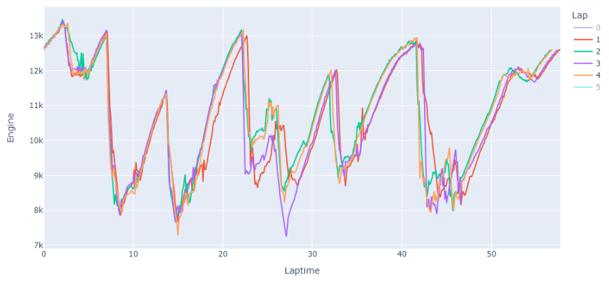

# krp_python_telemetry

Telemetry for [Kart Racing Pro](https://www.kartracing-pro.com/) using Python notebook ([Jupyter](https://jupyter.org/)) or using [Google Colab](https://colab.research.google.com/github/scls19fr/krp_python_telemetry/blob/main/telemetry.ipynb)

## Screenshots

Plot various data such as Engine (rpm), Distance,	CylHeadTemp	(°C), WaterTemp (°C), Gear, Speed	(km/h), LatAcc (G), LonAcc (G), Steer (°), Throttle (%), Brake (%), FrontBrakes (%), Clutch (%), YawVel (deg/s)

- Engine (rpm) vs Laptime

- Engine (rpm) vs Distance

Compare trajectory among differents laps

Plot Engine (rpm) histogram

## Installation

Install a scientific distribution of Python such as [Anaconda Python](https://www.anaconda.com/download) 

Dependencies:
- [Numpy](https://numpy.org/)
- [Pandas](https://pandas.pydata.org/)
- [Plotly](https://plotly.com/)

Run notebook using

    $ jupyter notebook

See also:
- KaRTA
  - http://www.lautrup.se/KaRTA/
  - https://github.com/flautrup/KaRTA
